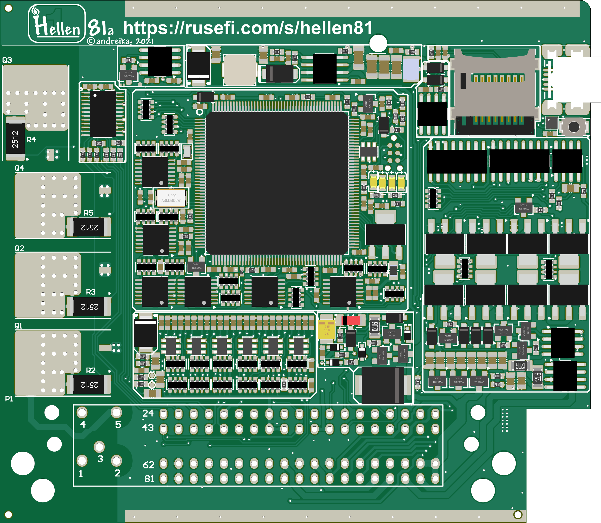

# hellen81

A Hellen-One board with a 81 pin connector for [rusEFI](https://github.com/rusefi/rusefi)!
An ultracompact and cheap yet full-functional 8-Cylinder ECU board compatible with M7.9.7/ME7.9.7/ME7.8.8/Yanvar7.2/Micas10.3.

https://github.com/andreika-git/hellen-one

https://github.com/rusefi/rusefi/wiki/Hellen81

Pinout:
https://docs.google.com/spreadsheets/d/e/2PACX-1vSg41St_69moQ2rh92Mo4bStP-pNEcl9Qb2QOHikwrR-RgWGXKjmL9DsMgeUy9ewP8MYs3RSP3EftIc/pubhtml

